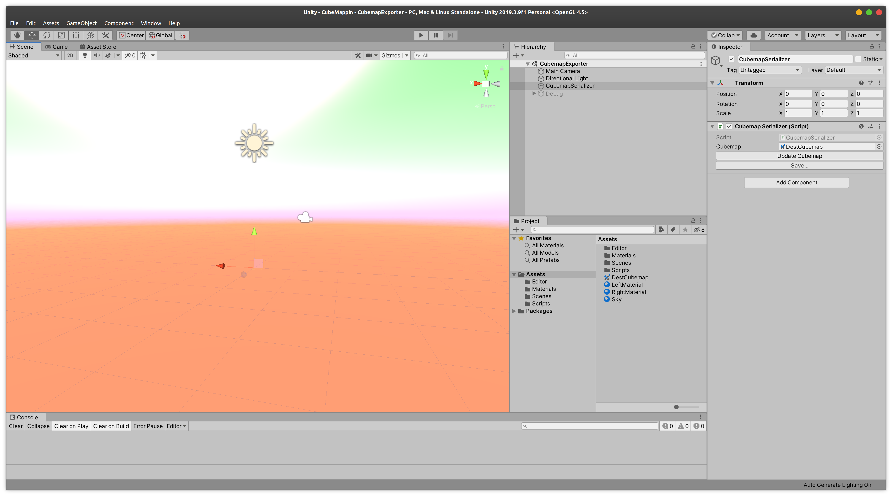
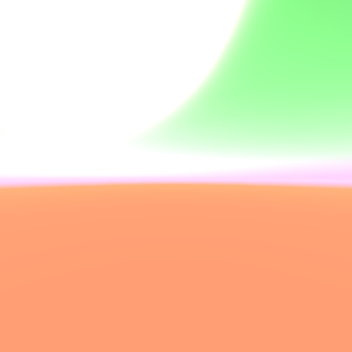

# CubeMappin
Simple tool to export cubemaps from Unity

I made this because I wanted a nice way to design skybox cubemaps for my opengl noodlings, and I figured Unity has great tooling for skyboxes, building environments, etc.

## Usage

1) Open the `CubemapExporter` scene.
2) Diddle with the sky material, put stuff in the scene, knock yourself out.
3) Click on `CubemapSerializer` in the `Heirarchy` pane, and click `Save...`.
4) Select a destination folder, and your cubemap will be exported as:
    - `top.png`
    - `bottom.png`
    - `front.png`
    - `back.png`
    - `left.png`
    - `right.png`

### Screenshots:

